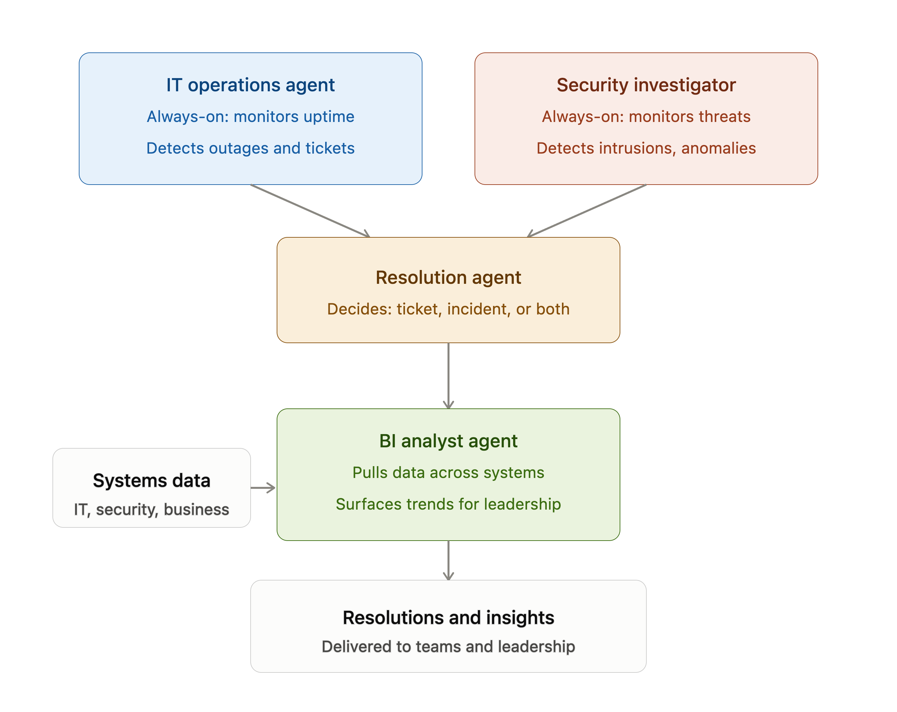

# **AI Digital Operations Center**

### **Background & Project Description** 
Many organizations today rely on a wide range of digital systems across teams, often using separate tools and workflows. Help Desk technicians specialize in resolving user issues, information security analysts investigate security threats, and business leaders monitor organizational performance. However, because these teams operate independently and with disconnected systems, organizations face persistent challenges in integrating data and processes, which creates barriers to holistic decision-making. Significant time is spent manually gathering information, investigating incidents, and detecting trends before making well-informed decisions, ultimately reducing overall efficiency. For example, in many traditional security operations centers (SOCs), gaps have emerged between security and operations teams due to differing priorities, procedures, and tools. These disconnects illustrate that fragmented workflows hinder collaboration and lead to inefficiencies and less effective security efforts.

Meanwhile, business demand for Microsoft continues to rise, and a capacity gap remains. These demands also outpace human capacity, leading more employees to turn to AI for capabilities humans lack, such as 24/7 availability, speed and quality, unlimited ideas, and unlimited capacity. According to a 2024 Microsoft Work Trend Index, about 68% of employees say they struggle with the pace and volume of work, and 46% feel burned out. In addition, about 76% of AI users bring their own AI tools to work. To deal with these challenges, My Digital Operations Center unifies IT Operations, Cybersecurity, and Business Intelligence into a single platform, helping organizations resolve issues faster, strengthen security, and improve operational efficiency. This multi-agent system consists of an IT Operations agent, a Security Investigator agent, a Resolution agent, and a BI Analyst agent.

With this approach, it is important to recognize that as technology advances, cyber threats continue to rise alongside AI. AI can serve as both a defensive necessity and a potential vulnerability. It assists in threat mitigation and response by automatically identifying and addressing threats and detecting security gaps and vulnerabilities. However, AI systems themselves may be susceptible to attacks such as prompt injection, in which malicious actors insert harmful commands, and data poisoning, in which attackers introduce false or manipulated data to undermine system integrity. These agent systems often process data from potentially unreliable sources, such as files or external online content, which increases the risk that adversaries could embed malicious instructions that the AI misinterprets as legitimate. This situation can result in unauthorized actions, the exposure of sensitive data, or a compromise of security protocols. Other risks include agents accidentally getting more access than they should, attackers stealing private information from AI models, and hackers targeting third-party software the system uses. To proactively address these multifaceted risks, I plan to enhance the security of the multi-agent system by strengthening its digital infrastructure. The platform will implement a comprehensive defense-in-depth strategy, consisting of prompt shields to inspect incoming prompts for injection threats, spotlighting techniques to monitor agent behavior and detect anomalies, and information flow control (IFC) policies to restrict unauthorized data movements. These layered security measures help to protect users and their data against the evolving landscape of cyber threats.

In conclusion, as technology advances and the talent gap increases, this AI agent system can help existing talent manage increasing workplace demands by expanding employees' capacity. By automating repetitive tasks, employees can spend more time on complex problems, work more efficiently, and feel less overburdened.

**Target Users**
- **Primary Users**: IT Help Desk Support Technicians, Security Operations Center (SOC) Analysts, Cybersecurity Analysts, Business Intelligence (BI) Analysts
- **Secondary Users**: IT Managers, Busienss Operations Managers, Technology Leadership
- **End Users**: Employees experiencing technical issues

**Solution Concept**
The following solution concept outlines how a multi-agent platform can address these needs of operations, security, and business intelligence within Microsoft. I plan to address this problem directly by using multiple agents that work cohesively to improve cross-team efficiency within Microsoft. The platform will include four primary agents:
1. **Operations Agent** - *reduces the workload of IT staff by automating common issues or concerns, giving them more time to focus on complex problems.*
    - Receives and classifies IT requests
    - Determines issue priority
    - Routes requests appropriately
2. **Security Investigator Agent** - *Demonstrates how security investigations will work in the real world using mock authentication events, sample login activity, and simulated security alerts. This agent helps cybersecurity analysts investigate more threats in less time, allowing them to focus on high-priority events.*
    - Evaluates authentication activity
    - Detects suspicious behavior
    - Remediates threats
    - Explains security risks
    - Recommends investigation actions
3. **Resolution Agent** - *Uses Azure AI Search (RAG) to retrieve Microsoft Learn documentation and internal knowledge to generate troubleshooting guidance.*
    - Searches organizational knowledge
    - Retrieves Microsoft documentation using  - Retrieval-Augmented Generation (RAG)
    - Generates troubleshooting recommendations
    - Assists with ticket resolution
4. **Business Intellgience/Analyst Agent** - *Analyzes trends, ticket categories, recurring issues, and AI performance to produce dashboards and recommendations. This agent helps business teams analyze trends much quicker.*
    - Analyzes operational trends
    - Identifies recurring issues 
    - Measures IT performance 
    - Generates dashboards and executive summaries 
    - Provides recommendations for continuous improvement

**Microsoft AI Platforms I Plan to Use:**
- Azure AI Foundry - AI Agent Development
- Microsoft 365 Copilot
- Microsoft Graph API - Provides access to Microsoft 365 data. 
- Azure AI Search (RAG) - Allows the Resolution Agent to retrieve relevant Microsoft Learn articles so that responses are based on trusted information.

**Expected Impact**
- IT Support: reduce IT ticket resolution time
- Security: provide a safer and more secure environment 
- Productivity: reduce repetitive manual work
- Business Analytics: improve visibility to operational performance
